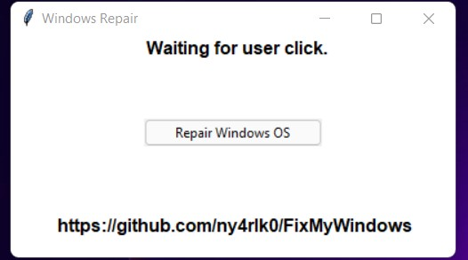
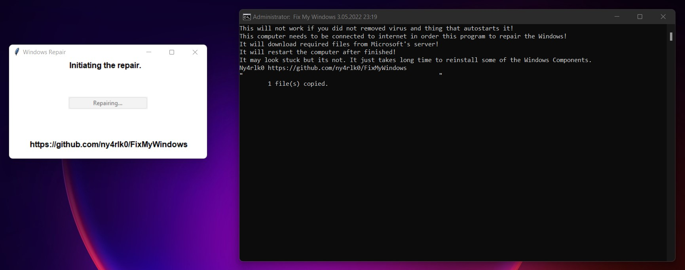

# FixMyWindows
Python based tool to fix common issues or virus releated issues on Windows. 
 It will download and run the latest patch from this repo.
 Best to scan your computer with some solid antivirus delete the virus then run this tool.
 This tool relies heavily on Windows Defenders detection capabilities.
 (To scan and delete the virus.)
 First it will dump to infection logs to desktop, after it will reset the most of the Windows Services Apps Settings to default. 
 (Including Group Policy, Firewall, Services, Defender, Windows Store etc.)
 Then will try to use Windows built in commands to initiate self repair.
 Finally it will scan everything that connected to this computer. (It should scan network drives too. I'm not so sure tho.)
 It will not delete your personal files!
 You can either use batch file or exe.
 Because of pyinstaller, Windows Defender Detects as virus. Well i dont have much choice. I dont have any way to sign with key. 
 (Or more like money in this case. Yes it costs 400$ a year to get a sign. Thx MS.)
 * Screen Shots:

    
    
